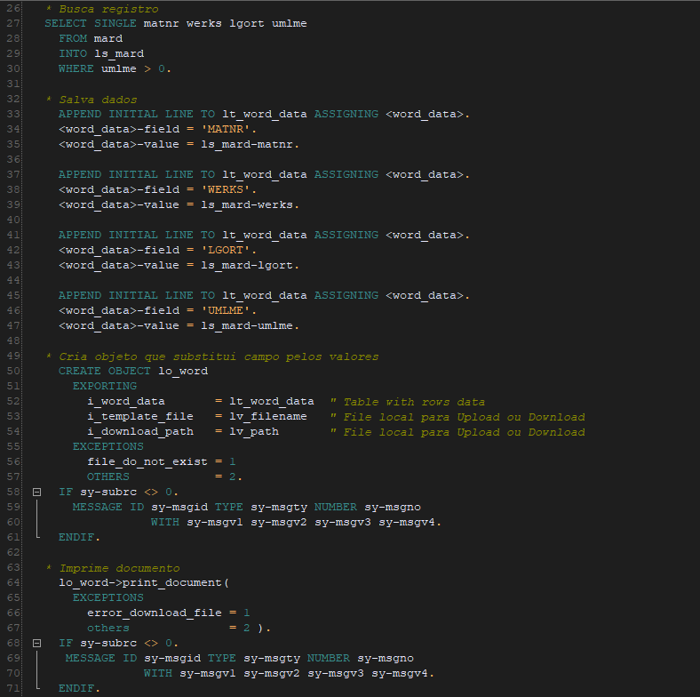

# Substituir tags no documento Word
 Classe que substitui campos de documento via mala direta.
 
 Pode ser criado qualquer documento Word e informado campos que podem ser substituidos por valores:
   
   
  Os campos adicionados via Correspondências(mala direta) no Word são substituidos pelo valores informados e impressos no final:
 

[Link documentação microsoft sobre mala direta no word](https://support.microsoft.com/pt-br/help/318118/how-to-use-the-mail-merge-feature-in-word-to-create-and-to-print-form) 

## Exemplo de uso

[Link programa de exemplo utilizando a classe](src/zwordmailmerge_example.prog.abap)

[Link documento de exemplo com as tags de mala direta](example/testdocument.docx)

Para utilizar a classe basta criar o objeto passando as informações:
| Parâmetro | Descrição |
| --- | --- |
| i_word_data | tabela com campo(field) que está mapeado no Word e valor(value) que será irá substituir o campo |
| i_template_file | informar o nome do documento Word |
| i_download_path | informar o diretório do arquivo |

 

